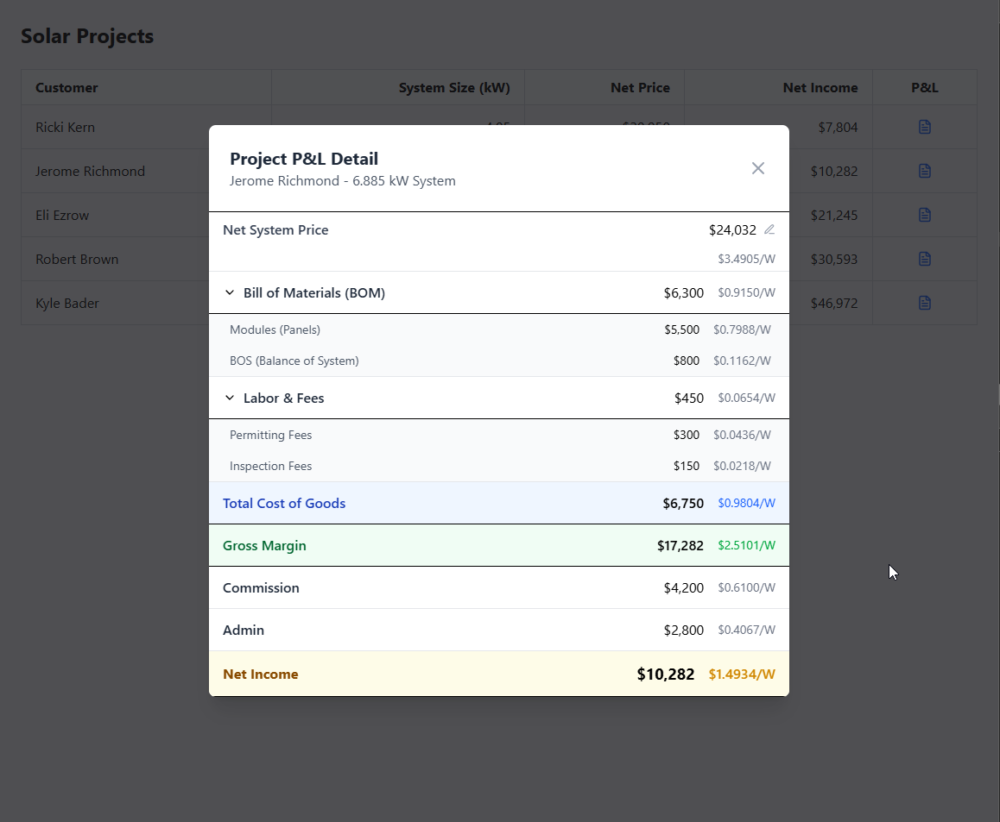

# Solar Finance

A SvelteKit app for managing solar finance.

## Created by @shahul01

## Screenshots



## Getting started

```bash
  # use node 22 directly or via nvm;
  # Required: {"node":"^20.19 || ^22.12 || >=24"}
  nvm use 22

  # install packages via npm or other package managers
  npm i

  # start sqlite db
  npm run db:setup

  # open client
  npm run dev -- --open
```

## Building

To create a production version of your app:

```bash
npm run build
```

You can preview the production build with `npm run preview`.

> To deploy your app, you may need to install an [adapter](https://svelte.dev/docs/kit/adapters) for your target environment.
