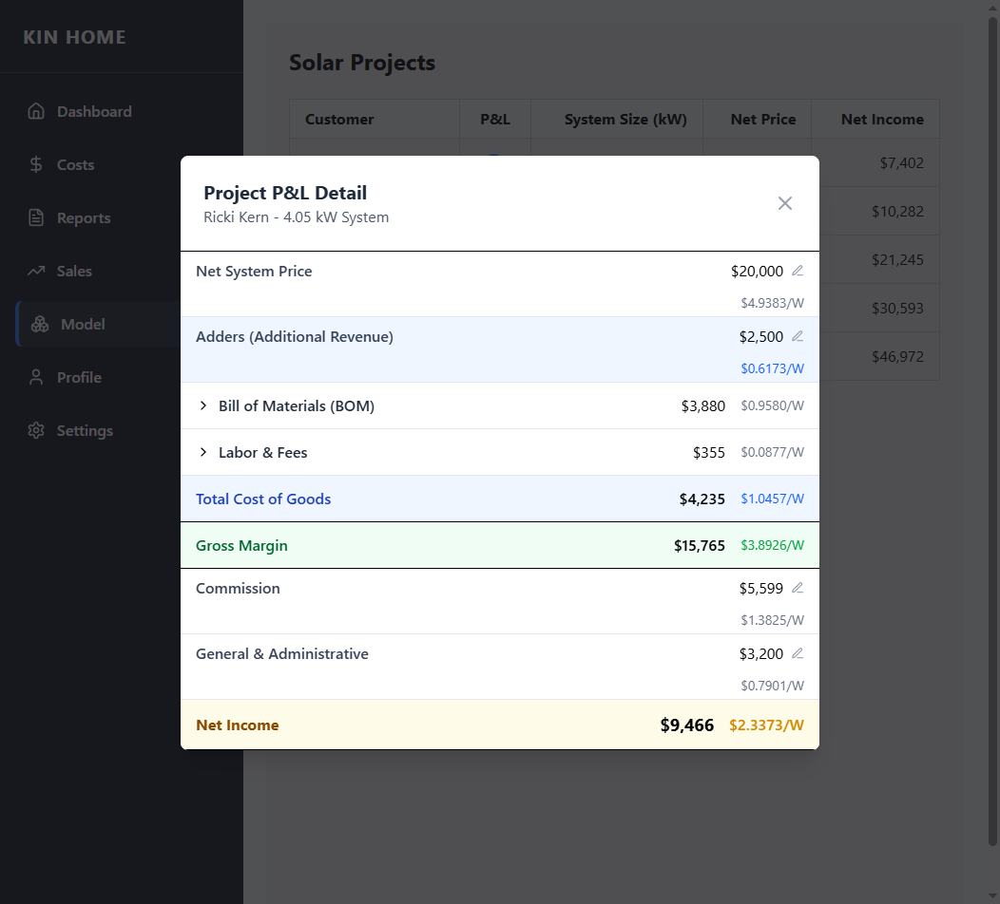

# Solar Finance

A SvelteKit app for managing solar finance.

## Created by @shahul01

## Screenshots



## Getting started

```bash
  # use node 22 directly or via nvm
  nvm use 22

  # install packages
  pnpm i

  # start sqlite db
  pnpm run db:setup

  # open client
  pnpm run dev -- --open
```

## Building

To create a production version of your app:

```bash
pnpm run build
```

You can preview the production build with `pnpm run preview`.

> To deploy your app, you may need to install an [adapter](https://svelte.dev/docs/kit/adapters) for your target environment.
